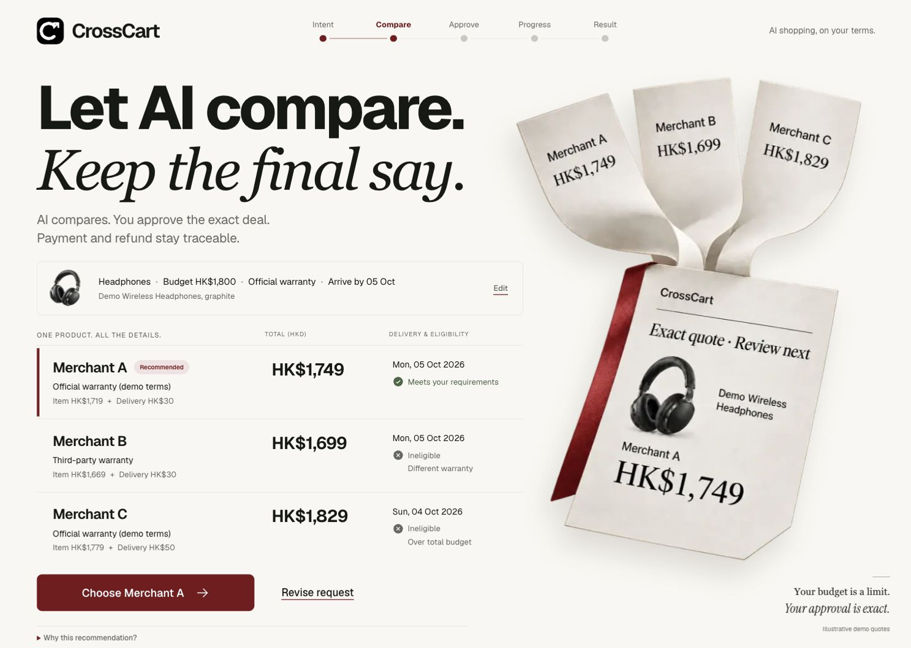

# CrossCart

**Let AI compare. Keep the final say.**

CrossCart is an AI shopping agent with a verifiable payment boundary. It compares three merchant offers, asks you to approve **one exact deal**, blocks changed terms before payment, and reconciles failed orders with the same charge and refund.

Built for **HacKU 2026 — FinTech: Agentic Commerce (Sponsored by The Club by HKT)**.

**[Live demo](https://crosscart.vercel.app/)** · **[3-minute video](https://crosscart.vercel.app/demo)** · **[Pitch deck PDF](https://crosscart.vercel.app/CrossCart-Pitch-Deck.pdf)** · **[Editable deck](https://crosscart.vercel.app/CrossCart-Pitch-Deck.pptx)**

[Judge guide](https://crosscart.vercel.app/evidence) · [Manual comparison](https://crosscart.vercel.app/benchmark) · [Submission fields](docs/SUBMISSION.md)

Public demo password: **crosscart-demo**. Stripe **test mode** only. Use synthetic billing details.

[Judge walkthrough](docs/JUDGE_GUIDE.md) · [Architecture](docs/ARCHITECTURE.md) · [Financial sources](docs/FINANCIAL_SOURCES.md) · [Validation](docs/VALIDATION.md)



## The 30-second idea

A HK$1,800 shopping budget is **not** permission to charge any amount below it. CrossCart binds approval to the product, seller, payee, exact HK$1,749 total, currency, warranty, delivery, terms and expiry. If the approved deal changes to HK$1,849, it requires fresh consent. If payment is captured but the merchant fails, it tracks recovery separately from purchase success.

```text
Describe → Confirm intent → Compare → Exact approval → Stripe test authorization
                                                     ↓
                                        Recheck terms → Capture → Order
                                                     ↓            ↓
                                               Block change   Reconcile / refund
```

## Try the three demonstrations

Sign in as **Demo buyer**, password **crosscart-demo**. Use synthetic details and Stripe's test card **4242 4242 4242 4242**, a future expiry and any CVC. No real money or goods move.

| Case | What to do | Required result |
| --- | --- | --- |
| Complete purchase | Default request → confirm date → Merchant A → approve HK$1,749 → Stripe test Checkout | Payment **CAPTURED**, order **CONFIRMED** |
| Reject changed deal | Fresh run → approve HK$1,749 → scenario **Price changes +HK$100** → execute | **BLOCKED**, current HK$1,849, payment **NOT EXECUTED**, no Checkout |
| Recover failure | Fresh run → scenario **Captured → order fails** → complete Checkout | Order **FAILED**, refund **REFUNDED** only after provider retrieval |

Open **Judge evidence** for the immutable mandate/version/hash, explicit approval timestamp, rule decisions, provider references and signed-webhook receipts. A hash identifies content integrity; it is not a user cryptographic signature.

The `/benchmark` page compares a three-screen manual layout with one normalized comparison using the **same synthetic offers**. Its reproducible comparison sequence is 4 versus 1 navigation actions. Approval and Checkout are common to both and excluded. It records actual browser actions/elapsed time without claiming a human-study time saving. Both choose the same HK$1,749 offer; no price saving is claimed.

The `/evidence` page explains sources and observations. Domestic-card Stripe processing is illustrated on the **merchant side**; rebates and Clubpoints are conditional references and do not reduce this demo's approved amount.

## What is implemented

- Cantonese/English intent interpretation with live DeepSeek when configured; visible, deterministic fallback on unavailable/invalid model output.
- Read-only `searchOffers` / `getOfferDetails` tools. Model prices and instructions cannot grant payment authority.
- Buyer confirmation of category, total budget, warranty and delivery before comparison.
- Immutable exact approval, server-owned payment amounts, accepted merchant quote and repeated pre-payment/pre-capture validation.
- Official Stripe **test-mode** Hosted Checkout, manual authorization/capture, cancellation, provider retrieval and refund.
- Stable operation keys, durable checkpoints and webhook deduplication. Redirect messages are never payment truth.
- Independent payment, merchant-order and recovery states; unknown responses reconcile the same operation.
- Responsive Consent Studio interface, keyboard focus, reduced motion and light/dark/system themes.

## Run locally

Node **22.13+** is required for `node:sqlite` (Vercel target: Node 24). All dependency versions are pinned.

```sh
git clone https://github.com/Gout999/CrossCart.git
cd CrossCart
npm ci
cp .env.example .env.local
npm run dev
```

Open `http://127.0.0.1:3107`. With the default local adapter, payment objects are explicitly simulated. Set `PAYMENT_PROVIDER=stripe` and a **test** secret key to enable official sandbox payments. Live keys/objects are rejected. Configure `AI_API_KEY`, `AI_MODEL` and `AI_BASE_URL` privately for the model; missing credentials use a labeled fallback.

```sh
npm run build
npm start
```

Local mode uses SQLite plus a separate durable worker. Data, secrets, runtime, private evidence and macOS storage backups are excluded from this repository. A portable regular-file export preserves the current workspace's code without committing its local iCloud workaround or ledger.

## Cloud runtime

Cloud deployment uses Vercel HTTPS and a dedicated PostgreSQL ledger. It **does not** rely on persistent SQLite files inside serverless functions. The tested synchronous coordinator runs against an isolated in-memory working copy under a PostgreSQL row lock; a complete state snapshot commits after each request or worker stage. This deliberately serializes the small hackathon demo, preserving the existing exact-consent and idempotency logic.

Signed Stripe webhooks and API requests trigger bounded background continuation with Next.js `after()`. A protected daily maintenance endpoint sweeps retained jobs. This is not an always-on production worker: failures beyond a function's duration remain persisted for a subsequent webhook, request or maintenance sweep.

Set server-only `DATABASE_URL`, `CROSSCART_PUBLIC_DEMO=true`, `APP_URL`, test Stripe/model credentials, `STRIPE_WEBHOOK_SECRET` and `CRON_SECRET`. Every public login gets a separate owner. AI/new-search usage is bounded; existing payment recovery is not cut off by the search allowance. Mobile uses the same HTTPS origin and an HTTP-only Secure SameSite=Lax cookie; no private LAN or matching Wi-Fi is required after public deployment.

## Verify

```sh
npm run lint
npm run typecheck
npm test
npm run build
npm run test:e2e
```

Offline SDK contracts, local simulated payments and actual Stripe sandbox checks are reported separately. Official tests require credentials and create test purchases:

```sh
npm run stripe:configure
npm run stripe:listen
npm run test:e2e:stripe
```

See [Validation](docs/VALIDATION.md) for dated results and scope. Never delete state to retry an unknown payment.

## Boundaries

Merchants, goods, warranty claims and orders are synthetic adapters; three demo merchants share one controlled Stripe test payee. There is no HKT/Club Shopping merchant integration, Clubpoints account, real settlement, government eID or legal-identity verification. Demo login is access isolation, not production identity. Provider refund success does not prove bank posting. The PostgreSQL snapshot ledger is a bounded prototype, not a scalable payment ledger. No external user-study findings or award outcomes are claimed.
