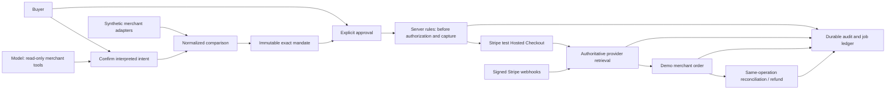

# Architecture and trust boundary

## Durable state

Local mode: SQLite WAL, synchronous transactions, leased jobs and a separate worker. Public Vercel mode: dedicated PostgreSQL `crosscart_ledger` row, transactional row lock, JSONB snapshot and revision. Each cloud request or single worker stage hydrates an isolated SQLite memory copy, runs the same coordinator and commits the snapshot. A function crash discards uncommitted memory; provider operations use the already persisted run/mandate and stable operation keys, allowing authoritative same-operation recovery.

The snapshot includes records, ordered audit events, jobs/lease tokens and webhook deduplication IDs. The local ledger is never uploaded. Concurrent functions serialize through PostgreSQL; they do not each invent a new local ledger. This is intentionally a low-volume prototype. Model requests can hold the shared lock; a lock timeout returns unavailability rather than dropping rules or inventing success.

`after()` drains bounded stages after the response. Authorization waits for Stripe webhooks or later API polling. A protected daily cron sweep is the last fallback, not a guarantee of subsecond background processing. Pending state survives cold starts and deployment changes. Continuous production recovery would require a dedicated scheduler/queue and a normalized ledger.

## Identity and source boundaries

Public demo sessions have separate random owners. Every shopping/run read and mutation checks ownership; JSON mutations require the configured origin. Cookies are HTTP-only, Secure on the public site, and SameSite=Lax for Checkout returns. Shared demo password is not verified identity. New AI/search work has per-session and global daily bounds; webhook and already-approved payment recovery remain available.

Only the server has provider/model/database keys. Model tools cannot approve, capture, cancel or refund. Catalog text and model output are untrusted. Provider mode is bound per run; official Stripe failure never becomes simulated success. Redirects and webhook payload states are not payment truth.
